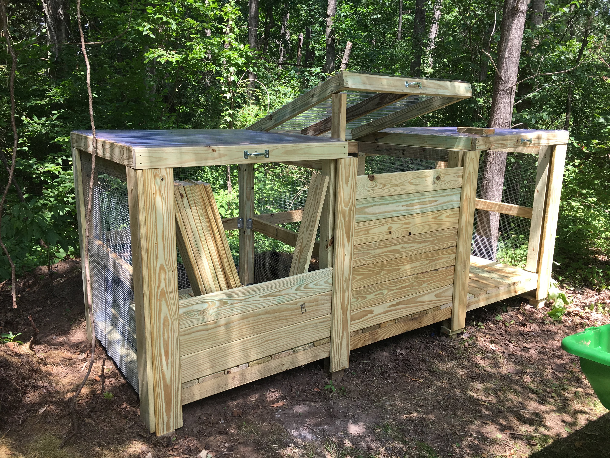

# Compost Bins Design

DIY project was to build three bin composter for use in garden. Design was drafted in Sketchup and presentation-based design description authored using LaTeX and Beamer.

[Source LaTeX file](inst_compost_bins.tex)

[Output PDF](inst_compost_bins.pdf)

No guarantees or warranties provided on the design and description! Use at own risk.
